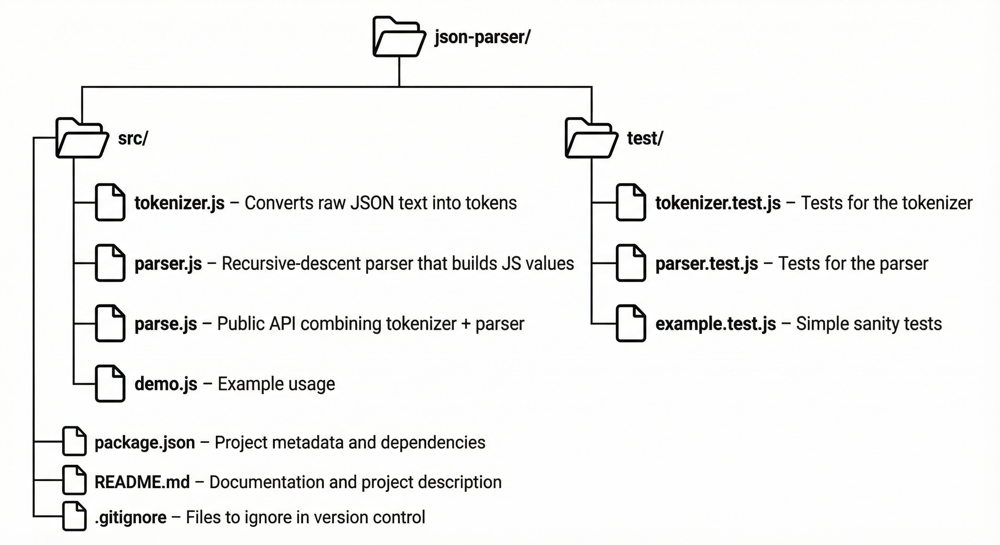

# JSON Parser From Scratch


## Project Overview

This project is a fully custom JSON parser built completely from scratch using Node.js.  
It replicates the core behavior of `JSON.parse()` without relying on built-in parsing tools,  
giving a clear look into how real parsers work under the hood.

The project includes:

- A tokenizer (lexer) that converts raw JSON text into meaningful tokens  
- A recursive-descent parser that builds JavaScript objects and arrays  
- Support for strings, escape sequences, numbers (including decimals and exponents), booleans, and null  
- Detailed, human-friendly error messages that show where and why parsing failed  
- A clean `parse()` function that ties the whole system together  
- Jest test suites to validate correctness

This parser teaches the fundamentals of lexical analysis, parsing, error handling, and compiler design in a simple, approachable way.

---

## Features

- **Full Tokenizer (Lexer)**  
  Converts raw JSON text into tokens such as strings, numbers, braces, brackets, commas, etc.

- **Recursive-Descent Parser**  
  Builds JavaScript objects and arrays based on JSON grammar.

- **String Escape Handling**  
  Supports `\"`, `\\`, `\n`, `\t`, `\b`, `\f`, `\r`, and more (Unicode optional).

- **Number Parsing**  
  Handles integers, decimals, negative numbers, and scientific notation (`1e5`, `-3.2E-4`).

- **Booleans & Null**  
  Proper support for `true`, `false`, and `null`.

- **Detailed Error Messages**  
  Shows the position and surrounding text when something goes wrong.

- **Clean Public API**  
  The `parse()` function behaves similarly to `JSON.parse()`.

- **Tested with Jest**  
  Includes a set of test cases for correctness and edge cases.

---

## Architecture Overview

The project is split into two major components:

### 1. Tokenizer (Lexer)
The tokenizer reads the raw JSON string character-by-character and produces a list of tokens such as:

- `{`, `}`, `[`, `]`, `:`, `,`
- STRING  
- NUMBER  
- TRUE / FALSE / NULL  

It also handles escape sequences, numeric formats, and whitespace skipping.

### 2. Parser (Recursive-Descent)
The parser consumes the stream of tokens and builds the final JavaScript value.  
It uses three core functions:

- `parseValue()`  
- `parseObject()`  
- `parseArray()`  

These functions follow JSON grammar rules and call each other recursively.

### Error Handling Layer
Both tokenizer and parser include custom helpers that show:

- the exact position of failure  
- nearby characters or tokens  
- a clear explanation of what went wrong  

### Public API

```js
const result = parse('{"a": 1}');
console.log(result); // { a: 1 }
```


---

## Directory Structure



---

## Installation

Clone the repository:

```bash
git clone https://github.com/Jay061205/JSON-Parser-From-Scratch.git
```
Move into the project folder:
```bash
cd JSON-Parser-From-Scratch
```
Install dependencies:
```bash
npm install
```
Run the test suite to verify everything works:
```bash
npm test
```

---

## Usage

You can use the parser by importing the `parse` function from the `src/parse.js` file:

```js
const { parse } = require('./src/parse');

const json = `{
  "name": "Jay",
  "age": 20,
  "skills": ["ReactJS", "Node.js"],
  "active": true
}`;

const result = parse(json);
console.log(result);
```
Output:
```bash
{
  name: "Jay",
  age: 20,
  skills: ["ReactJS", "Node.js"],
  active: true
}

```
You can also run the included demo:
```bash
node src/demo.js
```

---

## Internals Overview

This project is built around two core components: the **tokenizer** and the **parser**.  
Together, they convert raw JSON text into a fully structured JavaScript value.

### 1. Tokenizer (Lexer)

The tokenizer scans the input string character-by-character and produces a stream of tokens.  
Each token represents a meaningful part of JSON syntax.

**Responsibilities:**

- Skip whitespace  
- Detect punctuation symbols (`{}`, `[]`, `:`, `,`)  
- Parse strings with escape sequences  
- Parse numbers (supports decimals and scientific notation)  
- Parse booleans (`true`, `false`) and `null`  
- Throw detailed errors on invalid characters or malformed values  

**Example token output:**

```js
[
  { type: '{', pos: 0 },
  { type: 'STRING', value: 'a', pos: 1 },
  { type: ':', pos: 4 },
  { type: 'NUMBER', value: 1, pos: 5 },
  { type: '}', pos: 6 }
]
```

### 2. Recursive-Descent Parser

The parser consumes the token stream and reconstructs JavaScript structures following JSON grammar rules.

It uses three core methods:

- **parseValue()** – detects the next JSON value  
- **parseObject()** – builds objects from `{ ... }`  
- **parseArray()** – builds arrays from `[ ... ]`  

The parser walks through tokens using:

- **current()** – look at the current token  
- **consume()** – move to the next token  
- **expect(type)** – enforce correct syntax, else throw an error  

All errors include:

- exact failing position  
- nearby tokens for context  
- a readable explanation  

### 3. Public API: `parse()`

The `parse()` function wraps the pipeline:

1. Tokenize the input  
2. Parse the token stream  
3. Return the final JavaScript value  

**Example:**

```js
const result = parse('{"a": 1}');
console.log(result); // { a: 1 }
```

---

## Testing

This project uses **Jest** for testing.  
The test suite covers:

- Tokenizing strings, numbers, booleans, null, arrays, and objects  
- Handling escape sequences  
- Parsing nested structures  
- Error reporting for invalid JSON  
- Edge cases like empty objects, empty arrays, malformed numbers, etc.

### Run all tests:

```bash
npm test
```

Example test for the tokenizer:
```js
test("tokenizes a simple object", () => {
  const tokens = tokenizer('{"a":1}');
  const types = tokens.map(t => t.type);
  expect(types).toEqual(['{', 'STRING', ':', 'NUMBER', '}', 'EOF']);
});
```

Example test for the parser:
```js
test("parses nested arrays and objects", () => {
  const result = parse('[{"a":1}, [1,2,3]]');
  expect(result).toEqual([{ a: 1 }, [1, 2, 3]]);
});
```

---

## Benchmarks

Benchmarking is not included yet, but this project is structured so that performance tests can be added easily in the future.

The idea for the benchmark suite:

- Compare the custom parser with `JSON.parse()`  
- Test small, medium, and large JSON inputs  
- Measure tokenizer speed separately from parser speed  
- Detect performance bottlenecks in number parsing, escape handling, and recursion depth  

A future `benchmark/` folder may include scripts like:

- `bench-small.js`
- `bench-medium.js`
- `bench-large.js`
- `bench-vs-native.js`

This section will be updated once real benchmarks are created and tested.

---

## Error Examples

This parser includes detailed, human-friendly error messages that point to the exact location where parsing fails.  
Below are a few examples showing how invalid JSON is handled.

### 1. Unterminated String

Input:

```json
{"name": "Jay}
```

Output:
```bash
Unterminated string at position 9
 near: {"name": "Jay}

```

2. Invalid Escape Sequence

Input:
```js
{"text": "hello\qworld"}
```

Output:
```bash
Invalid escape sequence \q at position 15
 near: hello\qworld"}
```
3. Missing Quotes Around Object Key

Input:
```js
{a: 10}
```

Output:
```bash
Expected STRING key, got '{'
 near: { a : 10 }
```
4. Trailing Comma in an Array

Input:
```js
[1, 2, 3,]
```

Output:
```bash
Unexpected token ']' at position 7
 near: 2 3 , ]
```
5. Malformed Number

Input:
```js
{"value": 12.e5}
```

Output:
```bash
Invalid number at position 10
 near: 12.e5}
```

These examples demonstrate how the tokenizer and parser work together to provide precise error locations and meaningful context, making debugging significantly easier compared to silent failures.

---

## Future Improvements

There are several enhancements that could make the parser more complete, more efficient, or closer to production-grade behavior:

### ✔ Unicode Escape Handling
Support for `\uXXXX` sequences inside strings (e.g., emoji, international characters).

### ✔ Better Number Validation
Stricter checks to match the exact JSON specification for numbers (e.g., disallow leading zeros, handle `-0` correctly).

### ✔ Improved Error Recovery
Right now, parsing stops at the first error.  
A recovery system could highlight multiple errors in a single pass.

### ✔ Benchmarks & Performance Profiling
Add benchmark scripts to measure:
- tokenizer speed  
- parser speed  
- comparison with `JSON.parse()`  
- scaling with large files  

### ✔ Streaming Parser
Support parsing large JSON files chunk-by-chunk rather than loading all content into memory.

### ✔ CLI Tool
A simple command-line interface to run:

```bash
jsonparse file.json
```

---

## Contributing

Contributions are welcome!  
This project is primarily for learning, but improvements, bug fixes, and ideas are always appreciated.

If you’d like to contribute:

1. **Fork the repository**
2. **Create a new branch** for your feature or fix  
   ```bash
   git checkout -b feature-name
   ```

3. **Make your changes**
4. **Add or update tests** if needed
5. **Open a pull request** with a clear explanation of what you changed and why

Please avoid submitting automated or AI-generated patches unless you fully understand the changes. This project aims to stay readable, educational, and easy to follow.

---

## License / Usage Note

You’re free to use this project, learn from it, and modify it.  
Just don’t claim the original work as your own or blame me if something breaks.

This project is meant for educational and personal use, and no formal open-source license is applied.
---
## Credits

Built by Jay as a learning project to understand how JSON parsing works under the hood.

Special thanks to the open-source community and various compiler resources that inspired the structure of the tokenizer and parser.

This project was written entirely from scratch without relying on built-in JSON parsing tools, to keep the learning experience real and hands-on.

